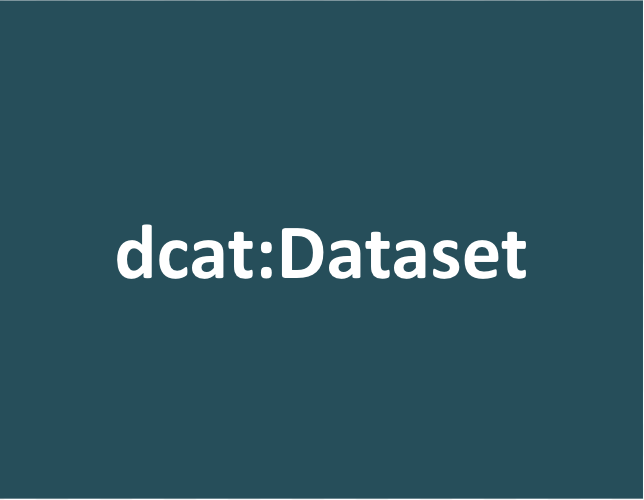

# Metadata Mapping Game
Educational simple game to train metadata mapping, in the context of Health-RI. It helps participants practice real-world metadata alignment, understand modeling challenges, and reflect on data completeness and schema design.
This version of the game was used in the Health-RI FAIR Data Stewards Basics Course 2025.

## Gameplay 
**Objective**: Reconstruct a structured metadata model by matching example dataset information to the Health-RI metadata schema using **Class**, **Property**, **Value**, and **Missing** cards. 

> No help from computers or phones is allowed!

### Steps of the game
1. Divide participants into groups.
2. Give each group a [printout of the Health-RI metadata schema](Simplified_HRI_metadata_version2_model.jpg) and a printout of an example dataset’s metadata (included in the [print version cards](print_version_cards)).
3. Explain the objective clearly. For example:  
   *“The goal is to correctly match dataset metadata to the schema using the right cards. Ambiguity may occur — that’s part of the learning!”*
4. Distribute the decks of cards to each group (the same deck for all groups). See [print version cards](print_version_cards).
5. Explain the different card types and their meanings (see [Card Types](#card-types)).
6. *Optional:* Keep a reference of card types visible during gameplay.
7. Encourage collaboration in the final minutes if the game is not competitive.
8. The game ends when all teams finish their mappings or the time runs out.

*Optional*: Competition element may be added. In this case, the game ends when the first group that creates a correct mapping. The mapping is checked by the game facilitator. If correct, the winner is announced and the game is finished, if not correct, the game continues until one group gets to the correct mapping.

## Card Types
- **Class card**  
  
This card represents an [rdfs:Class](https://www.w3.org/TR/rdf-schema/#ch_class) resource type from the Health-RI metadata schema. See the Health-RI metadata documentation for more information about the [Main](https://github.com/Health-RI/health-ri-metadata/tree/develop?tab=readme-ov-file#main-classes) and [Supporting](https://github.com/Health-RI/health-ri-metadata/tree/develop?tab=readme-ov-file#supporting-classes) classes.

- **Property card**  
  
This card represents an [rdf:Property](https://www.w3.org/TR/rdf-schema/#ch_property) resource type from the Health-RI metadata schema. It is important to place the properties to their correct class. Participants need to find out which property belongs to which class with the help of the diagram print out. 

- **Value card**  
  
This card contains a metadata value from the example dataset. Each Value card should be placed under the appropriate Property card, using both the example metadata and schema as guides.

- **Missing card**  
  
This card represent the missing value card in the metadata schema. The participants can use this card if they cannot find the correct value for a property, to let them know of missing information that would in real life situation still need to be collected.

## Relationships Between Cards

The cards in the game represent elements of a structured metadata model. The objective is to connect them in a way that reflects the [Health-RI metadata schema](https://github.com/Health-RI/health-ri-metadata). Each complete mapping should form chains like this:

[Class card] → [Property card] → [Value card or Missing card]

This mimics a semantic triple in RDF, where:
- The **Class card** represents the entity or subject (e.g., `Dataset`, `Agent`)
- The **Property card** represents an attribute or relation of that class (e.g., `title`, `description`)
- The **Value card** contains an actual metadata value from the example dataset (e.g., `"Brain MRI"`)
- The **Missing card** is used when a value is missing in the example metadata.

### Example

If the example metadata includes:
- **Title**: `"MRI Scan of the head"`
- **Version**: `"1.1"`

You would form the following structure:

- **[dcat:Dataset]**
  - → **[dct:title]** → "MRI Scan of the head"
  - → **[dcat:version]** → "1.1"

Where:
- `[dcat:Dataset]` is a **Class card**
- `[dct:title]` and `[dcat:version]` are **Property cards**
- `"MRI Scan of the head"` and `"1.1"` are **Value cards**

## Mapping steps
1. Analyze all cards.
2. Recreate the metadata model with `Class` and `Property` cards.
3. Review the example metadata.
4. Assign `Value` cards to the correct properties.
5. Use `Missing` cards where no matching value exists.
6. The game ends when a group finishes mapping all cards (some `Missing` cards may remain).

## Mapping Guidelines
- Each **Property card** must be matched with its correct **Class card** using the Health-RI schema printout.
- Each **Value card** must be placed under the correct **Property card** based on the example metadata.
- Use **Missing cards** when a value is expected but not present in the dataset.
- If the example metadata includes a value that is not represented in the schema, do not force it into the model — this is an opportunity to identify potential schema extensions.
- Some **Property cards** may be valid for multiple **Class cards**. Use schema references or group discussion to determine the correct mapping.
- The process may involve ambiguity or disagreement — resolving these collaboratively is part of the learning experience.
	 
## Encountered Problems
- There are more elements in the example metadata than in the model and
- There are more elements in the model than in the example metadata

## Solution
- Correct dataset, metadata schema and values matching
- Correct use of "Missing" cards

## Message of the game
- Sometimes you don't have all the elements of the model - they become elements for you to collect,
- Sometimes not all items you have are modelled - they become model requirements,
- Some elements can be confusing and not straightforward - refer to documentation,
- Mapping can be straightforward, but can also be ambiguous regarding interpretation. Seek community/data stewards help!

### Original game file  
[Google Drawing](https://docs.google.com/drawings/d/1dDPizLUXZn3D3pdFpaTxZ5YhQuxrSs_G8iNeWi4Hp1w/edit)

### Source  
Inspired by [Play-a-LOD](https://www.pldn.nl/wiki/Play-a-LOD)

### License
Shield:  
[![CC BY-NC-SA 4.0][cc-by-nc-sa-shield]][cc-by-nc-sa]

This work is licensed under a
[Creative Commons Attribution-NonCommercial-ShareAlike 4.0 International License][cc-by-nc-sa].

[![CC BY-NC-SA 4.0][cc-by-nc-sa-image]][cc-by-nc-sa]

[cc-by-nc-sa]: http://creativecommons.org/licenses/by-nc-sa/4.0/
[cc-by-nc-sa-image]: https://licensebuttons.net/l/by-nc-sa/4.0/88x31.png
[cc-by-nc-sa-shield]: https://img.shields.io/badge/License-CC%20BY--NC--SA%204.0-lightgrey.svg
